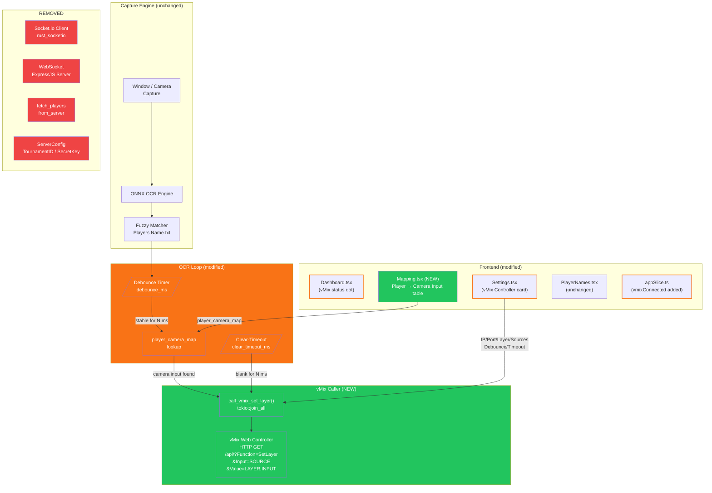

# Plan: vMix Web Controller Integration

**Status:** Awaiting Approval  
**Created:** 2026-05-23

---

## Goal

Replace the Socket.io / Express.js backend integration with direct calls to the vMix Web Controller HTTP API. The app must run fully standalone — no remote server, no WebSocket, no tournament ID. OCR detects a player name, fuzzy-matches it, looks it up in a local mapping table, and fires an HTTP GET to vMix's `SetLayer` endpoint for every selected target source simultaneously.

---

## Context

### What currently happens (old path)

1. OCR detects text → fuzzy-matches against `Players Name.txt`
2. Player ID looked up from `fetched_players` (pulled from Express API)
3. `playerDetected` event sent via Socket.io to remote server
4. Server updates a vMix overlay via its own vMix integration (fire-and-forget)

### What we need instead (new path)

1. OCR detects text → fuzzy-matches against `Players Name.txt`
2. Matched name looked up in local `player_camera_map` → vMix camera input name
3. For every checked target source: `GET http://[IP]:[Port]/api/?Function=SetLayer&Input=[Source]&Value=[Layer],[CameraInput]`
4. Debounce prevents spam; timeout fires `SetLayer…Value=[Layer],None` when OCR goes blank

### What stays the same

- Rust OCR engine (`capture.rs`, `ocr.rs`, `matcher.rs`)
- `Players Name.txt` + all player management UI (add, rename, remove, search)
- Region selector (window & camera)
- Scan interval, fuzzy threshold, debug screenshot settings

---

## New Config Shape (`config.json`)

```json
{
  "input_source": { "...": "unchanged" },
  "vmix": {
    "ip": "192.168.1.100",
    "port": 8088,
    "layer": 7,
    "target_sources": ["Gameplay"],
    "debounce_ms": 1500,
    "clear_timeout_ms": 5000
  },
  "player_camera_map": {
    "RHK.BLADE": "Camera 1",
    "X2.NRXJOD": "Camera 2"
  },
  "ocr": { "...": "unchanged" },
  "capture": { "...": "unchanged" },
  "saved_regions": { "...": "unchanged" }
}
```

---

## Strategy

### Rust (`lib.rs`)

- **Remove** `ServerConfig`, `Player`, `OcrState::sio_connected/sio_client/fetched_players`, and all Socket.io (`rust_socketio`) code + `urlencoding` dep
- **Add** `VmixConfig` and `player_camera_map: HashMap<String,String>` to `AppConfig`
- **Add** `vmix_last_sent: Mutex<Option<String>>` and `no_match_streak` stays (repurposed for clear-timeout) to `OcrState`
- **Replace** `run_socketio_loop` with a simple async `call_vmix_set_layer(ip, port, sources, layer, input_name)` that fires one GET per source simultaneously via `tokio::join_all`
- **Implement debounce** in OCR loop: track `pending_player: Option<String>` and `pending_since: Instant`; only call vMix when same name is stable for `debounce_ms`
- **Implement clear-timeout**: when no match for `clear_timeout_ms`, call `SetLayer…Value=[layer],None`
- **Remove commands**: `fetch_players_from_server`, `check_server_health`, `run_socketio_loop`
- **Add commands**: `test_vmix_connection`, `send_vmix_layer_clear` (manual clear button)
- **Keep commands**: all player CRUD, region selector, config load/save, start/stop OCR, check_backend

### Redux (`appSlice.ts`)

- Remove: `wsConnected`, `ocrAuthenticated`, `backendStatus` (server-specific), `fetchedPlayerCount`
- Add: `vmixConnected: boolean`, `lastVmixAction: string | null`
- Update `AppConfig` interface: remove `server`, add `vmix: VmixConfig`, `player_camera_map: Record<string,string>`

### Settings Page (replaces "Network Sync" card)

New **vMix Controller** card with:

- IP address input
- Port input (default 8088)
- Layer number input (default 7)
- Target Sources: list with add/remove buttons (user types vMix input names like "Gameplay", "OB 1")
- Debounce ms input
- Clear timeout ms input
- "Test Connection" button → calls `test_vmix_connection` → shows result badge

Remove: OCR Bridge toggle, API URL, Socket.io URL, Tournament ID, Secret Key, Source Mode, Source Slot, Fetch Players button

### New Mapping Page (replaces "Players" role as primary action page)

New **"Mapping"** tab (or subsection on Players page) showing a table:

- Column 1: Player name (from `Players Name.txt`, read-only, matched name)
- Column 2: vMix Camera Input (editable text field, saves to `player_camera_map`)
- Auto-save on blur/enter; shows unmapped players highlighted
- "Clear All Mappings" button

### Dashboard Status Card

Replace three status dots (OCR Engine, Server Connected, Authenticated) with:

- OCR Engine Ready (keep)
- vMix: Connected / Not Tested / Error (derived from last test result)
- Last Action: "RHK.BLADE → Camera 1 (Layer 7)" rolling status

Start button: enabled when OCR engine is ready (remove `backendOk && canStart` server-gating)

---

## Tasks

| #   | Task                                                                                    | Files Touched                |
| --- | --------------------------------------------------------------------------------------- | ---------------------------- |
| T1  | Rust: Replace ServerConfig → VmixConfig, update AppConfig, update default config        | `lib.rs`                     |
| T2  | Rust: Remove Socket.io loop, add vMix HTTP caller, debounce + clear-timeout in OCR loop | `lib.rs`, `Cargo.toml`       |
| T3  | Redux: Update AppConfig interface and state slices                                      | `appSlice.ts`                |
| T4  | Settings UI: Replace Network Sync card with vMix Controller card                        | `Settings.tsx`               |
| T5  | New Mapping UI: Player → vMix input mapping table                                       | New `Mapping.tsx`, `App.tsx` |
| T6  | Dashboard: Update status display, update start-button guard                             | `Dashboard.tsx`              |

---

## Risks

| Risk                                                                            | Mitigation                                                                                             |
| ------------------------------------------------------------------------------- | ------------------------------------------------------------------------------------------------------ |
| vMix uses HTTP (not HTTPS) — Tauri may have CSP issues with fetch from frontend | Use Rust `reqwest` via `invoke()` for all vMix calls (same pattern as `check_server_health`)           |
| Multiple simultaneous GET requests if many sources selected                     | Use `tokio::join_all` — all fire in parallel, log individual failures                                  |
| OCR flicker causing rapid vMix calls                                            | Debounce in Rust loop — configurable ms window                                                         |
| User has player names that don't match mapping keys exactly                     | Mapping keys are matched case-insensitively; show unmapped names highlighted in Mapping UI             |
| Removing `server` section breaks existing `config.json`                         | `#[serde(default)]` on all fields; migration: on load, if old `server` key present, ignore it silently |

---

## Architecture Diagram



**Legend:** Red = Removed | Orange = Modified | Green = New | Default = Unchanged
