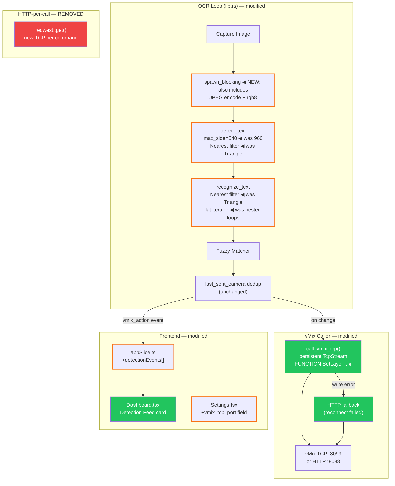

# Plan: Performance, Latency & UX Improvements

**Status:** Awaiting Approval
**Created:** 2026-05-23

---

## Goal

Four improvements to the live system:

1. **vMix TCP API** — replace per-call HTTP with a persistent TCP connection (port 8099) to eliminate connection-setup latency on every SetLayer command.
2. **OCR Speed** — reduce inference time via smaller detection input, faster image resize filter, and moving all CPU-heavy work off the async thread into a single `spawn_blocking`.
3. **Dashboard Detection Feed** — a dedicated, change-only panel showing which player/team is currently being sent to vMix (separate from the noisy general log).
4. **Standalone Build** — no code needed; documented here for reference.

---

## Context

### Current Architecture (relevant path)

```
OCR tick (100ms interval)
  │
  ├─ capture image (async thread)
  ├─ image_to_base64_jpeg()         ← on async thread (blocks event loop)
  ├─ preprocess_for_ocr()           ← on async thread (cheap, but still)
  ├─ spawn_blocking → run_ocr()     ← detection resize 960px, Triangle filter
  │                                    recognition resize, Triangle filter
  │                                    pixel normalization: nested for-loops
  │
  └─ on change → HTTP GET /api/?Function=SetLayer  ← new TCP per-call (3-way handshake)
                  per target source, parallel
```

### vMix API Options

| API                     | Protocol          | Latency                           | Connection             |
| ----------------------- | ----------------- | --------------------------------- | ---------------------- |
| HTTP REST (current)     | HTTP/1.1 over TCP | ~5-20ms/call (includes handshake) | New TCP per call       |
| **TCP API (port 8099)** | Raw TCP text      | **<1ms/call**                     | Persistent, reconnects |
| WebSocket               | ❌ Not available  | —                                 | —                      |
| SSE                     | ❌ Not available  | —                                 | —                      |

vMix TCP protocol:

- Connect to `{ip}:8099`
- Commands: `FUNCTION SetLayer Input={source} Value={layer},{camera}\r\n`
- Responses: `FUNCTION OK SetLayer\r\n` or `FUNCTION ER SetLayer ...\r\n`
- Send `QUIT\r\n` to close cleanly

### OCR Bottlenecks Identified

| Bottleneck                                                      | Current                      | Fix                            | Speedup            |
| --------------------------------------------------------------- | ---------------------------- | ------------------------------ | ------------------ |
| JPEG encode + rgb8 runs on async thread before `spawn_blocking` | Blocks Tokio runtime         | Move inside `spawn_blocking`   | Frees async thread |
| Detection input size                                            | `max_side=960`               | Reduce to `640`                | ~35% less pixels   |
| Detection resize filter                                         | `Triangle` (bilinear)        | `Nearest`                      | 3-5x faster resize |
| Recognition resize filter                                       | `Triangle`                   | `Nearest`                      | 3-5x faster resize |
| Pixel normalization (both det+rec)                              | Nested `for y … for x` loops | Chunk iterator with flat slice | 20-30% faster      |

Note: for small regions (height ≤ 120px), detection is already bypassed — only recognition runs. These improvements still apply to the recognition pass.

### Dashboard Detection Feed

Currently: `vmix_action` event updates `lastVmixAction` in Redux, shown as a single one-liner in the System Status card. The general LogViewer shows everything — detection changes, errors, warnings, all mixed together.

Requested: a dedicated, scrollable feed showing only player→camera transitions, timestamped, max 10 entries. Fires only when detection changes (already guaranteed by the Rust dedup logic).

### Standalone Build (no code needed)

```powershell
cd app
npm run tauri build
```

Output:

- Installer: `src-tauri/target/release/bundle/nsis/Efinity FaceCam_0.1.0_x64-setup.exe`
- Raw binary: `src-tauri/target/release/efinity-facecam.exe`

Models (`det.onnx`, `rec.onnx`, `en_dict.txt`) and `DirectML.dll` are already bundled via `tauri.conf.json` `resources` field. No extra steps needed.

---

## Strategy

### T1 — vMix TCP API (Rust)

- Add `vmix_tcp: tokio::sync::Mutex<Option<tokio::net::TcpStream>>` to `OcrState`
- On `start_ocr`: attempt to connect to `{ip}:8099`, store stream in state; failure is non-fatal (log warning, fall back to HTTP)
- Replace `call_vmix_set_layer` HTTP logic with `call_vmix_tcp`: write `FUNCTION SetLayer Input={source} Value={layer},{camera}\r\n` for each source, read response line
- On write error (broken pipe / timeout): reconnect once, retry; if still fails, fall back to single HTTP call and log
- On `stop_ocr`: send `QUIT\r\n` and drop stream
- Add `vmix_tcp_port` (default 8099) to `VmixConfig` — settings UI gets a new "TCP Port" field alongside the existing HTTP port
- `test_vmix_connection` tests both HTTP (8088) and TCP (8099), reports both

### T2 — OCR Speed (Rust, `lib.rs` + `ocr.rs`)

**`lib.rs`** (OCR loop):

- Merge `image_to_base64_jpeg` + `preprocess_for_ocr` into the same `spawn_blocking` closure as `run_ocr` so the async thread is freed immediately after capture

**`ocr.rs`** (detection):

- Reduce `max_side` from `960` to `640`
- Change `image::imageops::FilterType::Triangle` → `FilterType::Nearest` for detection resize

**`ocr.rs`** (recognition):

- Change `FilterType::Triangle` → `FilterType::Nearest` for recognition resize
- Replace nested `for y / for x` normalization loops with flat `.enumerate()` iterator on pixel chunks (avoids bounds-checking overhead)

### T3 — Dashboard Detection Feed (Frontend)

**`appSlice.ts`**:

- Add `DetectionEvent` interface: `{ time: string; player: string; camera: string; layer: number; cleared: boolean }`
- Add `detectionEvents: DetectionEvent[]` (max 10) to `AppState`
- Add `pushDetectionEvent` reducer (push + cap at 10) and `clearDetectionEvents`

**`App.tsx`**:

- In `vmix_action` listener: `dispatch(pushDetectionEvent({ time, ...payload }))`

**`Dashboard.tsx`**:

- Replace the single `lastVmixAction` line in System Status card with a dedicated **"Detection Feed"** card (below the Controls card, left panel)
- Scrollable, max-height ~160px
- Each row: `[HH:MM:SS] TEAM → Camera (L7)` or `[HH:MM:SS] Layer 7 cleared`
- Newest entry at top; empty state: "No detections yet"
- Clear button (same as log clear)

---

## Tasks

| #   | Task                           | Files                                                 | Effort |
| --- | ------------------------------ | ----------------------------------------------------- | ------ |
| T1  | vMix TCP persistent connection | `lib.rs`, `Cargo.toml`, `appSlice.ts`, `Settings.tsx` | Medium |
| T2  | OCR pipeline speed             | `lib.rs`, `ocr.rs`                                    | Small  |
| T3  | Dashboard Detection Feed       | `appSlice.ts`, `App.tsx`, `Dashboard.tsx`             | Small  |

---

## Risks

| Risk                                                      | Mitigation                                                                                                                |
| --------------------------------------------------------- | ------------------------------------------------------------------------------------------------------------------------- |
| vMix TCP port 8099 blocked by firewall                    | Fallback to HTTP; log clear warning; Settings shows both ports                                                            |
| TCP stream broken mid-session (network hiccup)            | Reconnect-once logic on write error; fall back to HTTP per-call                                                           |
| Reducing `max_side` 960→640 misses text in large captures | Only affects large-region captures; small regions (the typical use case, ≤120px height) already bypass detection entirely |
| `Nearest` filter hurts detection accuracy                 | For DBNet at 640px, `Nearest` is visually similar to `Triangle`; text is thick enough that subpixel quality is irrelevant |

---

## Architecture Diagram



**Legend:** Red = Removed | Orange = Modified | Green = New | Default = Unchanged
